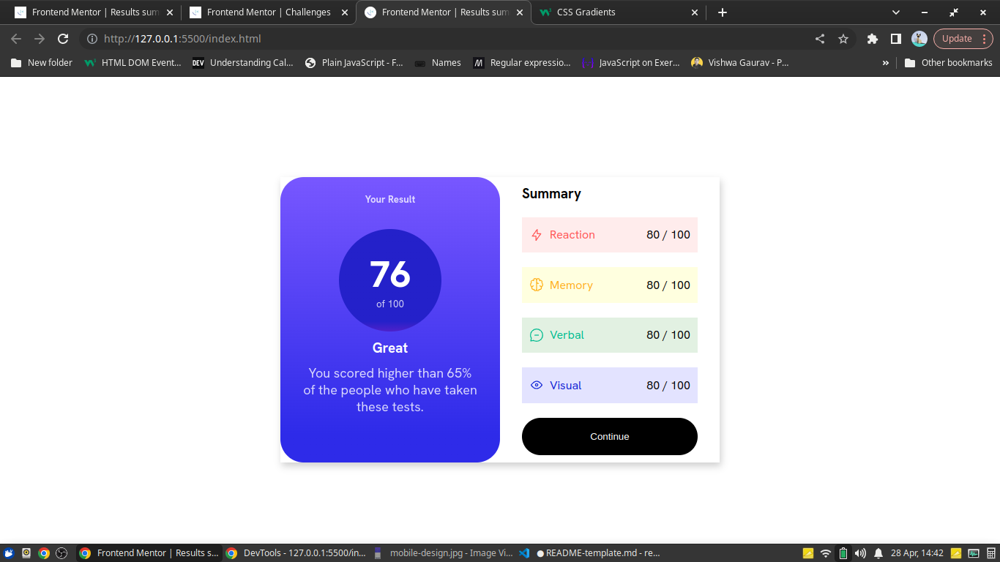

# Frontend Mentor - Results summary component solution

This is a solution to the [Results summary component challenge on Frontend Mentor](https://www.frontendmentor.io/challenges/results-summary-component-CE_K6s0maV). Frontend Mentor challenges help you improve your coding skills by building realistic projects. 

## Table of contents

- [Overview](#overview)
  - [Screenshot](#screenshot)
  - [Links](#links)
  - [Built with](#built-with)
  - [What I learned](#what-i-learned)
- [Author](#author)
**Note: Delete this note and update the table of contents based on what sections you keep.**

## Overview

### Screenshot

### Links

- Solution URL: [Add solution URL here](https://www.frontendmentor.io/solutions/result-summary-html-and-css-vIEsmAuHj5)
- Live Site URL: [live site URL](https://adebisi1234.github.io/frontendMaster1)

### Built with

- HTML5
- CSS

**Note: These are just examples. Delete this note and replace the list above with your own choices**

### What I learned

Relearned css gradients

## Author

- Website - [Twitter clone](https://www.mtwitter-clone.netlify.app)
- Frontend Mentor - [@Adebisi1234](https://www.frontendmentor.io/profile/yourusername)
- Twitter - [@AdebisiTobil](https://www.twitter.com/yourusername)
